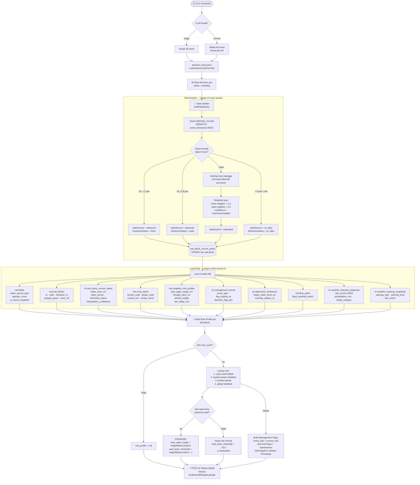
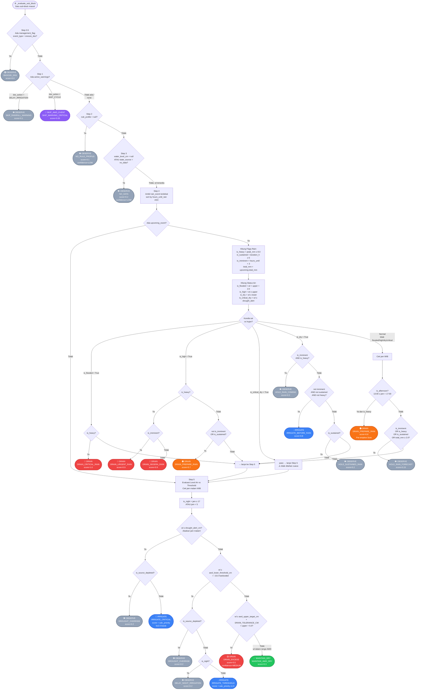
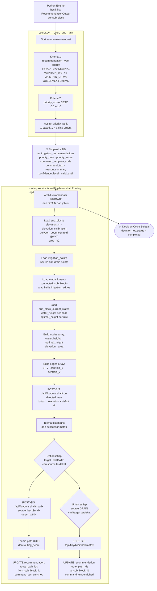
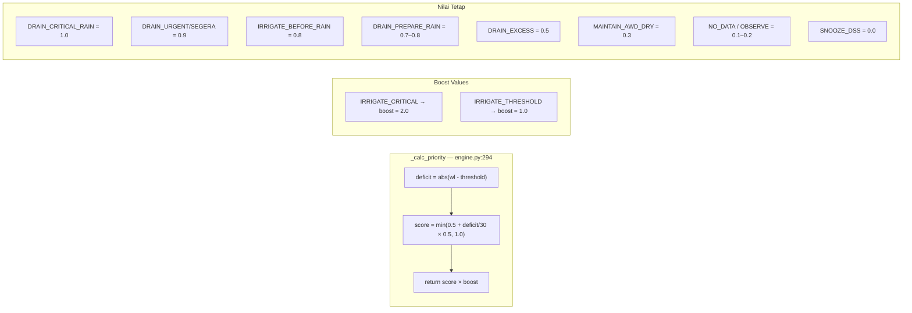
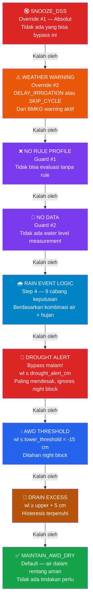

# DSS Real Flow — Smart AWD Decision Engine
**Berdasarkan implementasi kode nyata** | `engine.py` · `engine-client.service.ts` · `scorer.py`
*Diperbarui: 2026-07-01*

---

> Dokumen ini menggambarkan alur kerja **nyata** DSS (Decision Support System) ProTel Smart AWD
> dari trigger scheduler hingga rekomendasi tersimpan ke database, lengkap dengan semua parameter
> yang dipertimbangkan di setiap cabang keputusan.

---

## 1. Alur Pipeline End-to-End (Sistem Penuh)



---

## 2. Alur Engine Python — `_evaluate_sub_block` (Per Sub-Block)



---

## 3. Alur Scorer & Routing Post-Engine



---

## 4. Priority Score Formula



---

## 5. Parameter Lengkap yang Dipertimbangkan

### Input Parameters ke Engine

| Kategori | Parameter | Tipe | Sumber |
|---|---|---|---|
| **Field Context** | `water_source_type` | string | mst.fields |
| | `is_source_depleted` | boolean | mst.fields |
| | `operator_count` | integer | mst.fields |
| **Sub-Block State** | `water_level_cm` | float / null | trx.sub_block_current_states |
| | `state_source` | observed / estimated / no_data | trx.sub_block_current_states |
| | `freshness_status` | fresh / stale / no_data | trx.sub_block_current_states |
| | `interpolation_confidence` | 0.0–1.0 | Estimator (neighbor avg) |
| **Rule Profile** | `awd_upper_target_cm` | float | mst.irrigation_rule_profiles |
| | `awd_lower_threshold_cm` | float | **Hardcoded = -15.0** |
| | `drought_alert_cm` | float / null | mst.irrigation_rule_profiles |
| | `priority_weight` | float | mst.irrigation_rule_profiles *(tidak dipakai engine saat ini)* |
| | `rain_delay_mm` | float | mst.irrigation_rule_profiles |
| **Agronomic Override** | `target_water_level_cm` | float | trx.agronomic_treatments |
| | `override_expires_at` | timestamp | trx.agronomic_treatments |
| **Crop Cycle** | `phase_code` | string | mst.crop_cycles |
| | `bucket_code` | string | mst.crop_cycles |
| | `current_hst` | integer | mst.crop_cycles |
| **Management** | `event_type = snooze_dss` | boolean check | trx.management_events |
| | `flag_expires_at` | timestamp | trx.management_events |
| **Weather** | `rain_events[].peak_intensity_mm` | float | BMKG → weather_forecast_snapshots |
| | `rain_events[].hours_until_rain` | float | BMKG processed |
| | `rain_events[].duration_hours` | integer | BMKG processed |
| | `rain_events[].total_mm` | float | BMKG processed |
| **Warning** | `warning_type` | string | trx.weather_warning_snapshots |
| | `dss_action` | delay_irrigation / skip_cycle / none | trx.weather_warning_snapshots |
| **Jam Operasional** | `WIB hour` | integer 0–23 | datetime.now(WIB) realtime |

### Konstanta Engine (Hardcoded di engine.py)

| Konstanta | Nilai | Keterangan |
|---|---|---|
| `NIGHT_BLOCK_START_HOUR` | 17 | Jam awal blokir irigasi malam |
| `NIGHT_BLOCK_END_HOUR` | 5 | Jam akhir blokir irigasi malam |
| `DRAIN_TOLERANCE_CM` | 5.0 cm | Histeresis drain = upper + 5 |
| `is_heavy` threshold | ≥ 8.0 mm / 3-jam | Dari peak_intensity_mm rain event |
| `is_imminent` threshold | < 3 jam | Dari hours_until_rain |
| `is_sustained` threshold | ≥ 6 jam | Dari duration_hours |
| `is_wet` threshold (BMKG) | ≥ 2.0 mm | Dari tp field BMKG per slot 3-jam |
| `HEAVY_THRESHOLD` (BMKG) | ≥ 8.0 mm | Dari peak per slot 3-jam |
| `is_flooded` threshold | upper + 2.0 cm | Dalam konteks rain evaluation |
| `pre-emptive drain window` | 13:00–16:59 | Jam aktif DRAIN_PREPARE_RAIN |
| `awd_lower_threshold_cm` | -15.0 | Hardcoded pengganti kolom DB yang dihapus |

---

## 6. Override Priority Tree



---

## 7. Threshold Visual (Rule Profile Default — Fase Vegetatif)

```
Water Level (cm)
                    ▲
          +∞        │
                    │  ← Banjir ekstrem
          +10       │──────────────────── is_flooded = True   (upper + 2 cm)
                    │  [DRAIN saat hujan berat]
           +5       │══════════════════════ awd_upper_target_cm (fase vegetatif)
                    │  ← Zona aman AWD kering
                    │  MAINTAIN_AWD_DRY
             0      │──────────────────── Permukaan tanah
                    │  ← AWD kering
          -15       │══════════════════════ awd_lower_threshold_cm (HARDCODED)
                    │  [IRRIGATE_THRESHOLD jika siang]
                    │  [DELAY_NIGHT_IRRIGATION jika malam]
          -25       │══════════════════════ drought_alert_cm (fase veg early/late)
                    │  [IRRIGATE_CRITICAL — bypass malam!]
          -∞        │

          Note fase reproductive: upper = +10 cm, drought_alert = -12 cm (early)
          Note drain tolerance: DRAIN_EXCESS muncul saat wl ≥ +5 + 5 = +10 cm (vegetatif)
```

---

## 8. Scheduler — Cron Jobs Pendukung DSS

```mermaid
gantt
    title Jadwal Cron Jobs DSS (dalam 1 jam)
    dateFormat mm
    axisFormat %M menit

    section State Builder
    state-builder.job (tiap 10 menit)     : 00, 10m
    state-builder.job                      : 10, 10m
    state-builder.job                      : 20, 10m
    state-builder.job                      : 30, 10m
    state-builder.job                      : 40, 10m
    state-builder.job                      : 50, 10m

    section Stale Flag
    stale-flag.job (tiap 15 menit)        : 00, 15m
    stale-flag.job                         : 15, 15m
    stale-flag.job                         : 30, 15m
    stale-flag.job                         : 45, 15m

    section Decision Cycle
    decision-cycle.job normal (jam:00)    : 00, 5m
    decision-cycle.job siaga (jam:30)     : 30, 5m
```

| Job | Interval | Fungsi |
|---|---|---|
| `state-builder.job` | Tiap 10 menit | Refresh `sub_block_current_states` dari telemetry terbaru |
| `stale-flag.job` | Tiap 15 menit | Update `freshness_status`: fresh→stale (>2jam), stale→no_data (>8jam) |
| `bmkg-sync.job` | Tiap 3 jam | Fetch prakiraan cuaca BMKG, simpan ke `weather_forecast_snapshots` |
| `decision-cycle.job` | Tiap 30 menit | Trigger evaluasi DSS (normal=60min, siaga=30min) |
| `hst-updater.job` | Tiap tengah malam | Increment `current_hst` berdasarkan `planting_date` |

---

*Sumber: `engine.py` · `engine-client.service.ts` · `scorer.py` · `estimator.ts` · `bmkg.service.ts` · `scheduler.service.ts` · `stale-flag.job.ts` · `hst-updater.job.ts` · `seed.ts`*
