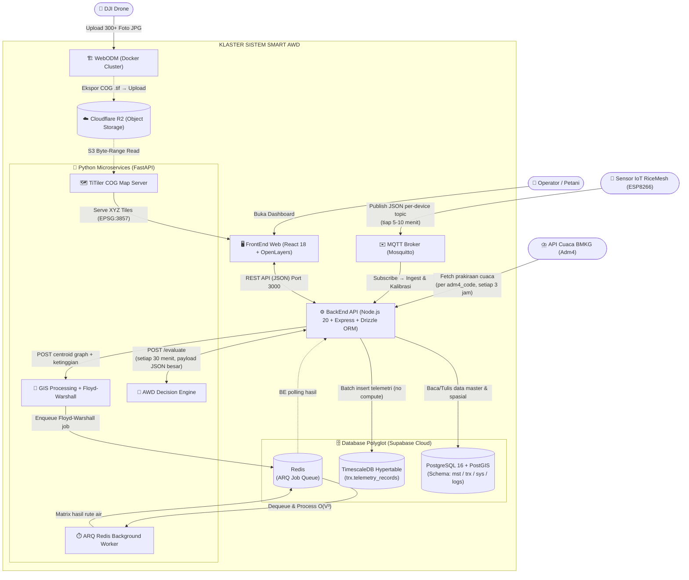

# 🏗️ TIER 1: Arsitektur Utama Sistem (C4 Model)
> **Update:** 29 Juni 2026 — Disesuaikan dengan kode sumber aktual (15 modul BE, embankments, assignments, dll.)

## 1. Ikhtisar Arsitektur
Proyek Smart AWD dipecah menjadi beberapa *Microservices* yang memiliki tugas spesifik untuk menghindari titik tunggal kegagalan (*Single Point of Failure*). Diagram di bawah ini merepresentasikan Model Arsitektur C4 tingkat *Container/Component*.

## 2. Diagram C4 Komponen & Aliran Data

## 3. Daftar Lengkap Modul BackEnd (15 Modul Aktif)

| # | Modul | Route Prefix | Fungsi |
|---|---|---|---|
| 1 | `health` | `GET /health` | Health check server |
| 2 | `auth` | `/auth/*` | JWT: login, refresh token, logout |
| 3 | `master-data` | `/fields, /sub-blocks, /devices, /embankments, ...` | CRUD semua entity master |
| 4 | `telemetry/ingest` | `POST /ingest/batch` | Terima batch data sensor dari MQTT gateway |
| 5 | `telemetry/query` | `GET /telemetry/sub-blocks/:id/history` | Query historis sensor time-series |
| 6 | `recommendations` | `/fields/:id/recommendations, /alerts` | Output DSS & peringatan aktif |
| 7 | `assignments` | `/assignments/pending, /completed` | Task management lapangan untuk operator |
| 8 | `agronomic-treatments` | `POST /fields/:id/agronomic-treatments` | Log intervensi agronomi manual |
| 9 | `dashboard` | `/dashboard` | Statistik & ringkasan keseluruhan lahan |
| 10 | `map-visual` | `/fields/:id/map-visual` | Data layer GeoJSON untuk peta FE |
| 11 | `orthomosaic` | `/fields/:id/orthomosaic, /map-layers` | Upload & manajemen layer citra drone |
| 12 | `archive` | `/crop-cycles/:id/complete` | Arsipkan siklus tanam yang selesai |
| 13 | `system-settings` | `/system-settings` | Konfigurasi global (admin only) |
| 14 | `scheduler` | *(internal daemon)* | Cron jobs otomasi (node-cron) |
| 15 | `weather` | *(internal service)* | Sinkronisasi data BMKG |

## 4. Penjelasan Interaksi Kritis
- **Pemisahan Penayangan Peta:** Backend Node.js sama sekali tidak memproses aset gambar peta. FrontEnd menarik lapisan poligon dan data rekomendasi dari Backend, tetapi menarik ubin peta (Tiles) secara terpisah langsung dari `TiTiler → Cloudflare R2`.
- **Komunikasi Internal:** Komunikasi antara Node.js dengan Python DSS dan GIS dilakukan via REST API privat di jaringan internal — tidak ter-ekspos ke internet.
- **Isolasi Tugas Berat:** Kalkulasi Floyd-Warshall O(V³) dilepaskan ke `ARQ Worker` melalui antrean Redis agar API tidak timeout.
- **Serverless Database:** Database berjalan di Supabase Cloud. Tidak perlu Docker database lokal. Migrasi dikelola via Drizzle ORM.
- **Per-Device MQTT Topic:** Setiap device memiliki MQTT topic unik yang di-generate otomatis via PostgreSQL trigger dengan format `field/{field_id}/sensor/{device_code}`.
- **Kalibrasi Dinamis IoT:** Rumus kalibrasi: `water_level_cm = (sensor_max_distance_mm - raw_distance_mm) / 10`. `sensor_max_distance_mm` disimpan di `mst.sensor_calibrations` per device.
