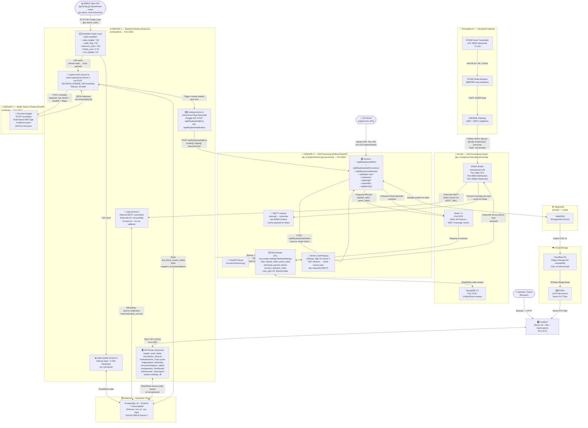
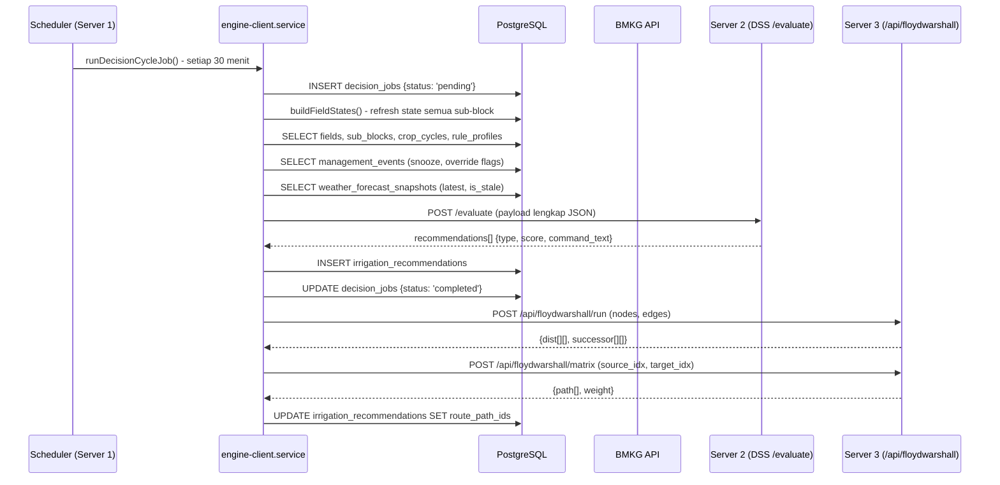

# 🏗️ Arsitektur Sistem (C4 Model) — Smart AWD
> **Update:** 29 Juni 2026 — Ditulis ulang berdasarkan inspeksi langsung source code aktual

---

## 1. Dua Server Terpisah

Berdasarkan kode sumber, sistem terdiri dari **dua server utama** yang disebut:
- **Server 1** = BackEnd Node.js/Express (`src/BackEnd`) → Port **3000**
- **Server 2** = Model Service Python/FastAPI (`src/Model`) → Port **8000**

Ditambah **satu proyek GIS terpisah** (`gis_risang/ricemesh-gis-processing`) → Port **8001** (default dari `GISPROC_API_BASE_URI`).

---

## 2. Diagram C4 — Arsitektur Aktual



---

## 3. Koreksi Penting vs Dokumentasi Sebelumnya

| Aspek | ❌ Dokumentasi Lama (Salah) | ✅ Aktual (Benar) |
|---|---|---|
| **MQTT Broker** | "Mosquitto" | **EMQX 5.8** (via Docker, port 1883/8083/18083) |
| **GIS Port** | "Port 8003" | **Port 8001** (`GISPROC_API_BASE_URI=http://localhost:8001`) |
| **GIS Database** | "Redis untuk queue Floyd-Warshall" | **MongoDB** untuk video assets, **Redis** untuk ARQ queue & MQTT cache |
| **GIS Fungsi** | "Hanya Floyd-Warshall" | Floyd-Warshall + **Video Ops** (upload/parse drone video) + WebODM management + MQTT listener |
| **Ingest IoT** | "Backend subscribe MQTT, batch insert" | Backend subscribe `sensor/data`, konversi raw→cm, insert via `processBatch()`. **GIS JUGA subscribe** semua device topic dari EMQX setelah login ke Server 1 saat startup. |
| **ARQ Worker** | "Floyd-Warshall worker" | ARQ Worker di GIS bertugas **video processing** (upload_video, parse_video, process_webodm_video). **Floyd-Warshall SYNCHRONOUS** — dipanggil langsung di-thread oleh `/api/floydwarshall/run` tanpa ARQ. |
| **FrontEnd calling GIS** | "FE tidak akses GIS" | `/webodm/*` route di GIS — **FE bisa langsung** manage WebODM projects. |
| **Framework** | "Node.js + NestJS" | **Node.js + Express** (bukan NestJS) |
| **Device Bootstrap** | Tidak ada di docs lama | GIS service **login ke Server 1** saat startup, ambil semua device topics, lalu subscribe ke EMQX. |

---

## 4. Detail Aliran Keputusan AWD (Decision Cycle — tiap 30 menit)



---

## 5. Detail GIS Processing Service (`ricemesh-gis-processing`)

GIS service ini adalah proyek independen di `gis_risang/` dengan arsitektur internal sendiri:

```
ricemesh-gis-processing/
├── docker-compose.yml  ← Start: MongoDB, Redis, EMQX MQTT broker
├── src/
│   ├── server/
│   │   ├── server.py           ← FastAPI app dengan lifespan
│   │   ├── routers/
│   │   │   ├── floyd_warshall_route.py  ← POST /api/floydwarshall/*
│   │   │   ├── videoOps_route.py        ← POST /api/video-ops/*
│   │   │   ├── webodm_route.py          ← /webodm/* (manage WebODM)
│   │   │   ├── mqtt_route.py            ← GET /api/mqtt (status)
│   │   │   ├── redis_route.py           ← GET /api/redis (cache)
│   │   │   └── job_log_route.py         ← GET /api/job-log
│   │   ├── controllers/
│   │   └── services/
│   ├── modules/
│   │   ├── floyd_warshall.py   ← Algoritma APSP murni Python
│   │   ├── mqtt_listener.py    ← aiomqtt subscriber (async loop)
│   │   ├── device_bootstrap.py ← Login ke Server 1, fetch device topics
│   │   ├── mqtt_emqx.py        ← EMQX HTTP API wrapper
│   │   ├── parsevid.py         ← Frame extraction (OpenCV)
│   │   ├── tiling.py           ← Image tiling utilities
│   │   └── segmentation/       ← FastSAM model (plot detection)
│   ├── arq_worker/
│   │   ├── settings.py         ← WorkerSettings (4 tasks: video ops)
│   │   └── tasks/
│   │       └── videoOps_task.py ← upload_video, parse_video, dll
│   └── db/
│       ├── connection.py        ← Motor (AsyncMongoClient) + Beanie
│       ├── gridfs_ops.py        ← GridFS binary operations
│       └── models/              ← Beanie Document models
└── main.py  ← Test/debug script (bukan server)
```

**Startup sequence GIS Server:**
1. `server.py` lifespan: connect MongoDB → init DB → connect Redis pool
2. `fetch_device_topics()`: HTTP login ke `RICEMESH_API_HOST` (Server 1) → GET `/devices` → kumpulkan semua MQTT topic
3. `start_mqtt_listener(topics, redis)`: spawn asyncio Task — subscribe EMQX → cache messages ke Redis pada key `mqtt_message:<topic>`

---

## 6. Environment Variables — Mapping Aktual

### Server 1 (BackEnd) — `.env`
```env
DATABASE_URL=postgresql://...    # Supabase Cloud
JWT_SECRET=...                   # Min 32 char
DECISION_ENGINE_URL=http://localhost:8000  # Server 2
GISPROC_API_BASE_URI=http://localhost:8001  # Server 3
MQTT_URL=mqtt://localhost:1883   # EMQX
BMKG_BASE_URL=https://api.bmkg.go.id/publik/prakiraan-cuaca
R2_ENDPOINT=...                  # Cloudflare R2
```

### Server 3 (GIS Processing) — `.env`
```env
WEBODM_ROOT=http://localhost:8000    # WebODM admin URL (BEDA dengan Server 2!)
MONGO_BASE_ADDRESS=localhost:27017   # MongoDB
DATABASE=ricemesh
REDIS_HOST=localhost                 # Redis ARQ + cache
REDIS_PORT=6379
EMQX_MQTT_HOST=localhost             # EMQX broker
EMQX_MQTT_PORT=1883
EMQX_MQTT_USER=admin
EMQX_MQTT_PASS=public
RICEMESH_API_HOST=http://localhost:3000  # → Server 1 untuk bootstrap
RICEMESH_API_EMAIL=admin@smartawd.id
RICEMESH_API_PASS=DevPassword123!
```

> ⚠️ **Port Conflict Warning:** `WEBODM_ROOT=http://localhost:8000` dan `DECISION_ENGINE_URL=http://localhost:8000` mengarah ke port yang sama. Di deployment nyata, **WebODM** dan **Server 2 (DSS)** harus diberi port berbeda.

---

## 7. Startup Order yang Benar

```
1. ✅ Supabase DB (cloud — selalu tersedia)
2. ✅ docker compose up (di gis_risang/ricemesh-gis-processing/)
   → MongoDB, Redis, EMQX start
3. ✅ Server 2 (Model DSS): uvicorn app.main:app --port 8000
4. ✅ Server 1 (BackEnd): npm run dev → connects DB, start MQTT listener, start scheduler
5. ✅ Server 3 (GIS): uvicorn server.server:gisProc --port 8001
   → Startup: auto-login Server 1, fetch topics, subscribe EMQX
6. ✅ ARQ Worker (opsional, untuk video ops): arq arq_worker.settings.WorkerSettings
7. ✅ FrontEnd: npm run dev (port 5173)
```
