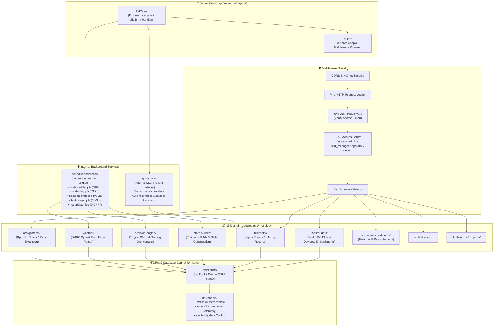

# ⚙️ Arsitektur Spesifik Bagian: BackEnd Orchestrator
> **Update:** 29 Juni 2026 — Isolasi Komponen Internal BackEnd Node.js/Express

## 1. Batasan & Fokus Ruang Lingkup

Dokumen ini membedah arsitektur internal server utama BackEnd (`src/BackEnd`) **secara terisolasi dari sistem luar**. Fokus diberikan pada penataan 15 modul domain, alur request middleware, penjadwalan cron internal, pool koneksi database, dan event loop listener MQTT.

---

## 2. Diagram Arsitektur Internal BackEnd

---

## 3. Detail Anatomi Internal

### A. Lifecycle & Middleware Pipeline (`server.ts`, `app.ts`)
Setiap request HTTP yang masuk melewati rintangan ketat sebelum menyentuh business logic:
1. **Security & Validation:** Helmet menjaga header HTTP, CORS membatasi asal domain, dan Zod mengevaluasi body/query parameter agar tepat struktur. Jika salah, langsung ditolak dengan HTTP 400.
2. **Authentication & RBAC:** Middleware `requireAuth` memvalidasi HMAC SHA256 JWT. Setelah lolos, `requireFieldAccess` mengecek peran pengguna (Role-Based Access Control) atas lahan yang diminta.

### B. Arsitektur 15 Modul Domain (`src/modules/`)
BackEnd menerapkan pola *Modular Monolith*. Setiap modul memiliki folder independen dengan file `.router.ts`, `.controller.ts`, `.service.ts`, dan `.schema.ts`:
- **`master-data/`**: Mengelola entitas statis sawah, galengan (`embankments`), petak, dan siklus tanam.
- **`telemetry/`**: Bertanggung jawab menerima pembacaan sensor mentah via HTTP batch atau MQTT, lalu mengalibrasi elevasi/jarak (`(max_distance - raw) / 10`).
- **`state-builder/`**: Membangun snapshot ketinggian air harian per petak sawah. Menggunakan estimator jarak dan interpolasi K-NN jika ada sensor rusak.
- **`decision-engine/`**: Menyatukan data cuaca dan state lahan untuk memicu siklus keputusan serta merangkai rute irigasi air.
- **`assignments/`**: Manajemen tugas harian operator di lapangan berdasar rekomendasi DSS.

### C. Guarded Cron Scheduler (`modules/scheduler/`)
Scheduler internal menjalankan 5 rutinitas penting menggunakan `node-cron`. Untuk mencegah *race condition* (misal job sebelumnya belum selesai saat jadwal berikutnya tiba), scheduler menggunakan *wrapper function* `guarded(name, fn)` berbasis `Set<string>`. Jika job dengan nama sama masih aktif di memori, jadwal baru akan diabaikan secara aman.

### D. ORM & Database Client (`db/client.ts`)
Menggunakan **Drizzle ORM** di atas koneksi pool `pg.Pool`. Konfigurasi pool dibatasi (`min: 2, max: 10`) dengan timeout idle 30 detik untuk menjaga konsumsi memori server tetap efisien.
