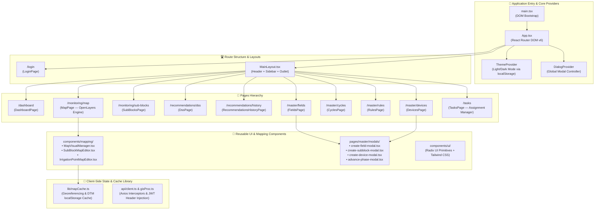

# 🖥️ Arsitektur Spesifik Bagian: FrontEnd (React SPA)
> **Update:** 29 Juni 2026 — Isolasi Komponen Internal FrontEnd

## 1. Batasan & Fokus Ruang Lingkup

Dokumen ini menjelaskan rancangan internal aplikasi web FrontEnd (`src/FrontEnd`) **tanpa ketergantungan atau koneksi eksternal** ke BackEnd, DSS, atau GIS. Fokus diberikan pada hierarki komponen React, manajemen state internal, routing navigasi, dan arsitektur rendering peta OpenLayers.

---

## 2. Diagram Arsitektur Internal FrontEnd

---

## 3. Komponen Utama Internal

### A. Core Engine & Providers (`src/App.tsx`, `main.tsx`)
Aplikasi dibungkus oleh tiga provider utama:
1. `BrowserRouter`: Menangani navigasi SPA berbasis History API di browser.
2. `ThemeProvider`: Mengelola tema visual (light/dark mode) dengan menyisipkan class `dark` pada elemen HTML root dan menyimpan preferensi pengguna di `localStorage("smart-awd-theme")`.
3. `DialogProvider`: Mengelola status pembukaan dan penutupan modal/dialog popup secara global tanpa prop-drilling berlebihan.

### B. Mapping Engine Layer (`components/mapping/`)
Komponen pemetaan adalah bagian paling kompleks di FrontEnd, dibangun menggunakan **OpenLayers**:
- **`MapVisualManager.tsx`**: Renderer utama peta. Bertanggung jawab memuat layer dasar (OSM/Satellite), menempatkan *raster tile* orthomosaic dari URL eksternal, dan menggambar *vector layer* poligon petak sawah.
- **`SubBlockMapEditor.tsx` & `IrrigationPointMapEditor.tsx`**: Komponen interaktif interaksi peta yang memungkinkan pengguna melakukan *drawing*, *editing geometri*, dan penempatan titik sumber/pembuangan air langsung di atas peta berkoordinat EPSG:4326 / EPSG:3857.

### C. Client Cache & Georeference (`lib/mapCache.ts`)
Karena rendering peta membutuhkan informasi transformasi geometri (CRS, batas koordinat X/Y, affine transform), FrontEnd memiliki mekanisme caching internal (`mapCache.ts`). Data *Digital Terrain Model (DTM)* dan batas koordinat disimpan di `localStorage` per nama field lahan agar peta dapat diload secara instan saat operator berpindah halaman tanpa harus re-fetch konfigurasi geometri setiap detik.

### D. Networking & Interceptor Shield (`api/client.ts`)
Modul ini mengisolasi logika HTTP request. Menggunakan Axios dengan *Request Interceptor* yang secara otomatis mengambil `accessToken` dari `localStorage` dan menyisipkannya ke header `Authorization: Bearer <token>`. Jika terjadi error 401 (Unauthorized), interceptor disiapkan untuk memicu alur refresh token atau pengalihan ke halaman `/login`.

---

## 4. Pola Rendering & Desain Antarmuka

- **Styling System:** Menggunakan **Tailwind CSS** dipadukan dengan **Radix UI Primitives** untuk menjamin aksesibilitas (a11y) standar tinggi (keyboard navigation, ARIA attributes).
- **Data Visualization:** Menggunakan **Recharts** pada halaman `/dashboard` dan `/monitoring/sub-blocks` untuk menampilkan grafik deret waktu (time-series) tinggi air lahan terhadap ambang batas AWD secara mulus dan responsif.
