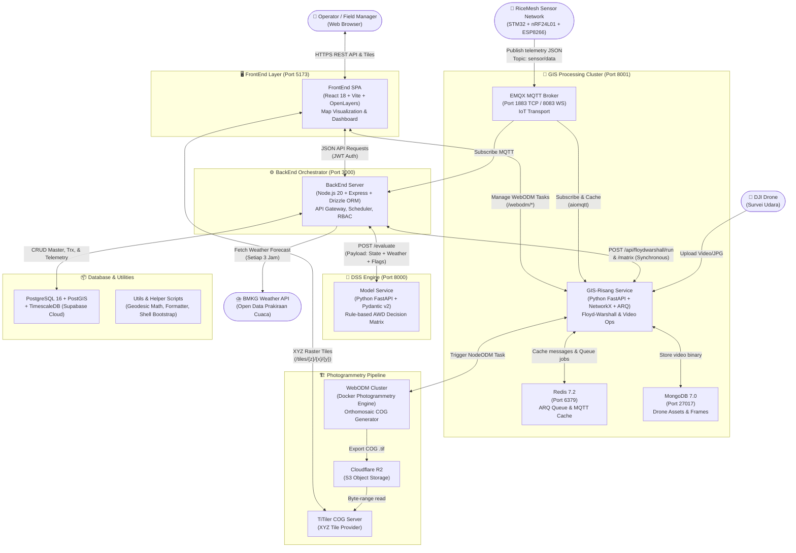

# 🌐 Arsitektur Sistem Umum (General System Architecture) — Smart AWD
> **Update:** 29 Juni 2026 — Dokumen Arsitektur Ekosistem Keseluruhan

## 1. Gambaran Umum Ekosistem

ProTel Smart AWD adalah ekosistem pemantauan dan manajemen irigasi sawah presisi berbasis **Internet of Things (IoT)**, **Sistem Pendukung Keputusan (DSS)**, dan **Sistem Informasi Geografis (GIS)**. Sistem ini dirancang secara terdistribusi (microservices-oriented) yang terdiri dari 6 komponen utama:
1. **FrontEnd (FE):** Antarmuka pengguna berbasis React 18 & OpenLayers.
2. **BackEnd (BE):** Pusat saraf (Orchestrator) berbasis Node.js/Express.
3. **Model DSS:** Service evaluasi agronomi berbasis Python/FastAPI.
4. **GIS Processing (`gis_risang`):** Engine Floyd-Warshall APSP, MQTT Listener, & ARQ Video Worker berbasis Python/FastAPI.
5. **WebODM:** Cluster fotogrametri pemetaan pematang & lahan dari foto drone.
6. **Utils & Scripts:** Kumpulan perpustakaan utilitas bersama dan skrip otomasi.

---

## 2. Diagram Interkoneksi Ekosistem (General C4 Container)

---

## 3. Korelasi Antar Bagian (Inter-Service Matrix)

| Komponen Asal | Komponen Tujuan | Protokol / Jalur | Deskripsi Korelasi |
|---|---|---|---|
| **FrontEnd** | **BackEnd** | HTTP REST (JSON) | Pengambilan data master lahan, pematang, device, histori rekomendasi, dan submit action task operator. |
| **FrontEnd** | **GIS-Risang** | HTTP REST (JSON) | Upload video survei drone dan pemantauan progress task WebODM langsung via route proksi GIS `/webodm/*`. |
| **FrontEnd** | **TiTiler (R2)** | HTTP GET (XYZ Tile) | Pemuatan peta orthomosaic COG lahan sawah sebagai layer OpenLayers. |
| **BackEnd** | **Model DSS** | HTTP POST (`/evaluate`) | Pengiriman snapshot state lahan harian & prediksi cuaca BMKG untuk mendapatkan matrix rekomendasi irigasi/drainase. |
| **BackEnd** | **GIS-Risang** | HTTP POST (`/floydwarshall/*`) | Perhitungan rute air terpendek dari sumber air ke petak sawah target berdasarkan kontur elevasi & galengan. |
| **BackEnd** | **EMQX (GIS)** | MQTT TCP (`1883`) | Langganan (subscribe) telemetry realtime dari gateway ESP8266 pada topik `sensor/data`. |
| **GIS-Risang** | **BackEnd** | HTTP GET (`/devices`) | Device bootstrap: saat startup, GIS login ke BackEnd untuk mengambil daftar topik semua device agar bisa discrape via MQTT. |
| **GIS-Risang** | **WebODM** | HTTP REST API | Pengiriman dataset foto drone untuk dijahit menjadi orthomosaic GeoTIFF oleh engine NodeODM. |
| **Utils** | **All Services** | Library / Module Import | Menyediakan fungsi perhitungan geodetik standar (`geodesic_distance_m`), formatter Zod/Pydantic, dan skrip otomasi bash. |

---

## 4. Alur Kerja Utama Sistem (End-to-End Orchestration)

1. **Ingest Telemetry:** Sensor di sawah mengukur tinggi air → ESP8266 publish MQTT ke EMQX → BackEnd & GIS menangkap data → BackEnd mengonversi tick ke cm dan menyimpannya ke TimescaleDB.
2. **State Construction:** Setiap 10 menit, cron job di BackEnd menghitung rata-rata tinggi air per sub-block dan melakukan interpolasi K-NN untuk sensor yang mati/offline.
3. **Decision & Routing (Tiap 30 Menit):** BackEnd mengambil forecast BMKG + state lahan → kirim ke **Model DSS** (`/evaluate`) → DSS merespons rekomendasi (Drain/Irrigate) → BackEnd meminta rute air ke **GIS-Risang** (`/floydwarshall/run`) → Rekomendasi & rute disimpan ke DB.
4. **Visualisasi & Eksekusi:** Operator membuka **FrontEnd** → melihat peta sawah dengan animasi jalur air (polyline) → menjalankan tugas penutupan/pembukaan pintu air di lapangan.
