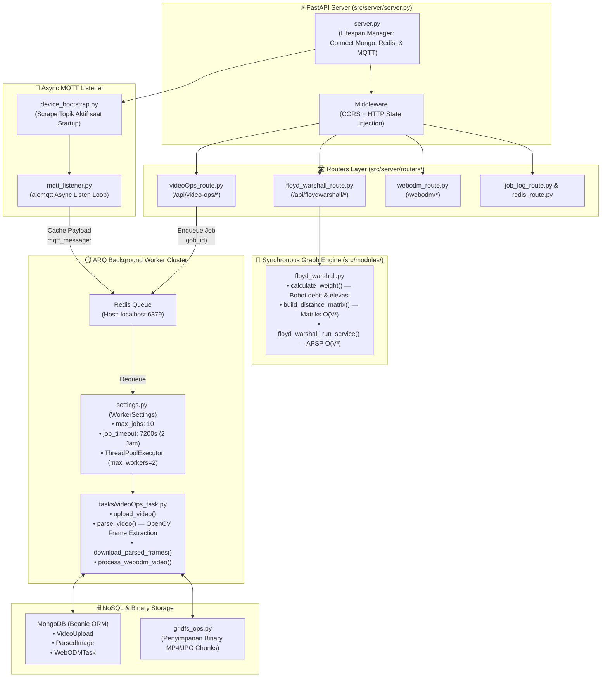

# 📐 Arsitektur Spesifik Bagian: GIS Processing Cluster (`gis_risang`)
> **Update:** 29 Juni 2026 — Isolasi Komponen Internal GIS Processing & ARQ Worker

## 1. Batasan & Fokus Ruang Lingkup

Dokumen ini membedah arsitektur internal layanan GIS (`gis_risang/ricemesh-gis-processing`) secara terisolasi. Fokus diarahkan pada algoritma All-Pairs Shortest Path (Floyd-Warshall) murni Python, mekanisme background worker ARQ untuk ekstraksi frame video drone, integrasi penyimpanan MongoDB/GridFS, dan siklus asinkron MQTT listener.

---

## 2. Diagram Arsitektur Internal GIS Processing

---

## 3. Detail Komponen Internal

### A. Synchronous Floyd-Warshall APSP (`modules/floyd_warshall.py`)
Fitur pencarian rute air dieksekusi secara **synchronous** di dalam *request-response cycle* FastAPI. Alurnya:
1. **Perhitungan Bobot (`calculate_weight`):** Bobot sisi ($W_{ij}$) dihitung dari jarak Euclidean antar koordinat petak sawah yang dikalikan dengan penalti selisih ketinggian elevasi ($E_{ij} = 100 \times \Delta\text{elevasi}$ jika air harus naik) serta hambatan volume air.
2. **Matriks Jarak O(V²):** Bangun matriks ketetanggaan berukuran $N \times N$, di mana self-loop bernilai $0.0$ dan simpul yang tidak terhubung bernilai $\infty$.
3. **Pencarian Rute O(V³):** Melakukan iterasi kaskade Floyd-Warshall untuk mencari jalur terpendek (All-Pairs Shortest Path) sekaligus merekam matriks `successor` untuk rekonstruksi jalur poligon air.

### B. ARQ Background Worker & Video Ops (`arq_worker/`)
Pemrosesan survei video drone yang memakan waktu lama dipisahkan dari thread utama web server menggunakan antrian **ARQ berbasis Redis**:
- **`WorkerSettings`**: Dikonfigurasi untuk menangani maksimal 10 tugas secara serentak dengan batas waktu pelaksanaan 2 jam (`job_timeout: 7200`).
- **CPU Thread Pool:** Untuk ekstraksi frame gambar dari file MP4 drone menggunakan OpenCV (`parsevid.py`), worker menyediakan `ThreadPoolExecutor(max_workers=2)`. Ini mencegah operasi pemotongan frame memblokir *asyncio event loop*.

### C. MongoDB Beanie ORM & GridFS (`db/`)
File video mentah yang diunggah serta ribuan frame gambar JPG hasil ekstraksi disimpan di **MongoDB GridFS** dalam bentuk *chunks* biner berkapasitas tinggi. Metadata informasi seperti resolusi, durasi, dan framerate (FPS) dipetakan menggunakan ODM (Object Document Mapper) **Beanie**.

### D. MQTT Listener Subsystem (`modules/mqtt_listener.py`)
Saat servis dimulai, `lifespan` memicu `fetch_device_topics()` untuk mengumpulkan daftar topik MQTT yang aktif. Servis kemudian menjalankan *asynchronous task* (`start_mqtt_listener`) menggunakan library `aiomqtt`. Setiap pesan telemetry yang masuk langsung dikonversi ke JSON dan disimpan sementara dalam cache Redis (`mqtt_message:<topic>`) untuk keperluan pembacaan instan oleh modul lain.
