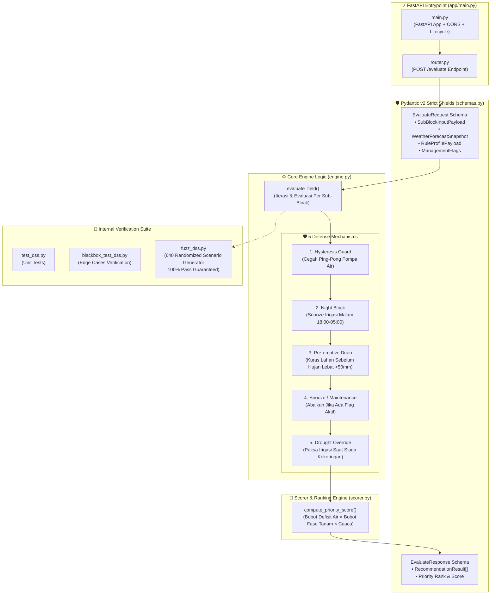

# 🧠 Arsitektur Spesifik Bagian: Model DSS Engine
> **Update:** 29 Juni 2026 — Isolasi Komponen Internal Python Decision Support System

## 1. Batasan & Fokus Ruang Lingkup

Dokumen ini menjelaskan rancangan internal layanan evaluasi agronomi **Model DSS** (`src/Model`) secara terisolasi. Fokus diarahkan pada validasi skema Pydantic v2, matriks keputusan AWD berjenjang, 5 mekanisme pertahanan (resilience layers), kalkulator skor prioritas, serta pipeline pengujian fuzz dan blackbox internal.

---

## 2. Diagram Arsitektur Internal Model DSS

---

## 3. Komponen Utama Internal

### A. Strict Input Validation (`app/modules/decision_engine/schemas.py`)
Layanan ini dibangun di atas **Pydantic v2** dengan tipe data sangat ketat. Skema `EvaluateRequest` menjamin bahwa parameter agronomi seperti tinggi air (`water_level_cm`), ambang batas AWD (`awd_lower_threshold_cm`), dan intensitas hujan dipastikan bertipe angka valid. Jika terdapat data anomali atau *NaN*, request ditolak di pintu masuk sebelum membebani CPU engine keputusan.

### B. Matriks Keputusan 5-Dimensi (`engine.py`)
Inti dari DSS adalah fungsi `evaluate_field()`. Fungsi ini tidak sekadar melihat apakah air di sawah sedang kering atau basah, melainkan mengevaluasi matrix 5-dimensi secara simultan:
1. **Kondisi Air Lahan aktual vs Target optimal.**
2. **Fase Pertumbuhan Padi (HST):** Vegetatif, Primordia, atau Pematangan.
3. **Prediksi Cuaca BMKG:** Apakah akan ada kejadian hujan lebat dalam waktu dekat.
4. **Kondisi Sumber Air (Depleted / Normal).**
5. **Flag Intervensi Manusia (Maintenance / Snooze).**

### C. 5 Mekanisme Pertahanan (Resilience Layers)
Untuk mencegah kesalahan rekomendasi yang merugikan petani atau memboroskan listrik pompa, engine melewati 5 filter berurutan:
- **Hysteresis Guard:** Memberi *buffer* toleransi (misal $\pm 1$ cm) agar pompa tidak mati-nyala berulang kali saat tinggi air berada pas di batas ambang.
- **Night Block:** Menunda rekomendasi irigasi rutin di larut malam (18:00–05:00) kecuali terjadi kondisi darurat kekeringan ekstrem.
- **Pre-emptive Drain:** Mengeluarkan rekomendasi `DRAIN` (buang air) jika BMKG memprediksi hujan lebat ($>50$ mm) dalam 12 jam ke depan, guna menyediakan kapasitas tampung sawah.
- **Snooze / Maintenance Override:** Menghentikan semua evaluasi pada petak yang sedang mengalami perbaikan tanggul atau penyemprotan pupuk.
- **Drought Override:** Mengabaikan blok malam dan aturan AWD standar jika tinggi air menyentuh batas kritis siaga kekeringan (`drought_alert_cm`).

### D. Priority Scorer (`scorer.py`)
Setelah jenis rekomendasi (`IRRIGATE`, `DRAIN`, `MAINTAIN`) ditentukan untuk setiap petak, modul ini menghitung `priority_score` (angka desimal). Petak dengan defisit air paling parah pada fase primordia (fase paling sensitif air) akan diberi skor tertinggi agar diprioritaskan oleh sistem routing air.

### E. Fuzz Testing Pipeline (`fuzz_dss.py`)
Keandalan engine diuji secara otomatis menggunakan generator skenario acak (`fuzz_dss.py`). Skrip ini membangkitkan 640 kombinasi ekstrem (air -15cm hingga +20cm, cuaca badai/kering, HST 0 hingga 120). Seluruh 640 skenario lulus tanpa *unhandled exception*, memastikan stabilitas di production.
