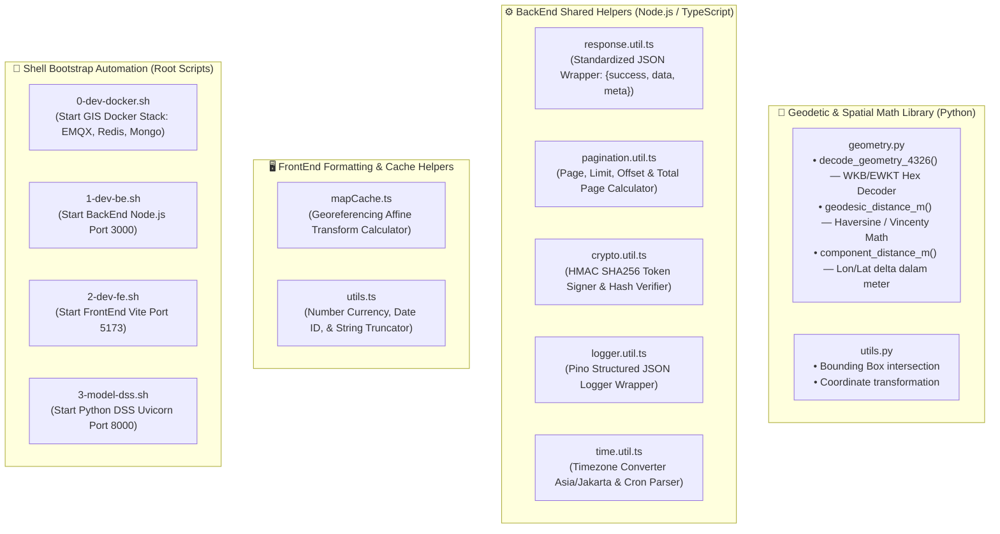

# 🧰 Arsitektur Spesifik Bagian: Utilities & Shared Libraries
> **Update:** 29 Juni 2026 — Isolasi Komponen Internal Utilitas Bersama & Skrip Otomasi

## 1. Batasan & Fokus Ruang Lingkup

Dokumen ini membedah rancangan modul utilitas bersama (`Utils`, `shared/utils`, dan `gis_risang/.../utils`) secara terisolasi. Fokus diarahkan pada perpustakaan perhitungan geodetik spasial, utilitas enkripsi/hasher, standarisasi respons API, serta skrip bootstrap otomasi ekosistem.

---

## 2. Diagram Arsitektur Internal Utilitas & Skrip

---

## 3. Detail Komponen Internal

### A. Geodetic Spatial Library (`gis_risang/.../utils/geometry.py`)
Modul matematika spasial ini ditulis murni dalam Python tanpa bergantung pada server database eksternal:
- **`decode_geometry_4326(data)`**: Mengurai string biner *Extended Well-Known Binary (EWKT/WKB)* berformat heksadesimal dari database PostGIS menjadi array koordinat titik geometri bertipe linier.
- **`geodesic_distance_m(p1, p2)`**: Menghitung jarak presisi tinggi dalam satuan meter di atas permukaan bumi melengkung menggunakan rumus geodetik. Sangat krusial untuk menentukan panjang rute selokan air antar centroid sawah.

### B. BackEnd Shared Helpers (`src/BackEnd/src/shared/utils/`)
Kumpulan utilitas TypeScript untuk menjaga standar kode di seluruh 15 modul BackEnd:
- **`response.util.ts`**: Menjamin format balikan REST API selalu konsisten (`{ success: boolean, data: any, message?: string }`).
- **`pagination.util.ts`**: Menghitung kalkulasi offset halaman secara otomatis dari query parameter `page` dan `limit`.
- **`crypto.util.ts`**: Menyediakan abstraksi kriptografi asli Node.js untuk penandatanganan token keamanan HMAC SHA256.

### C. Shell Bootstrap Automation (`src/`)
Skrip-skrip pendek berbasis shell/bash di root direktori disediakan untuk menyederhanakan alur kerja pengembangan multi-server agar developer tidak perlu membuka banyak terminal secara manual.
