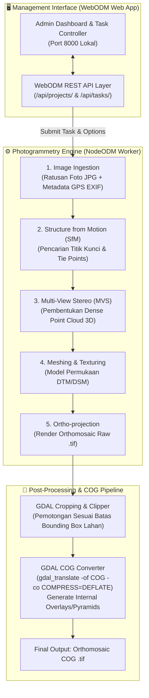

# 🏗️ Arsitektur Spesifik Bagian: WebODM Photogrammetry Cluster
> **Update:** 29 Juni 2026 — Isolasi Komponen Internal Pemetaan Drone WebODM

## 1. Batasan & Fokus Ruang Lingkup

Dokumen ini menjelaskan rancangan internal cluster fotogrametri **WebODM** secara terisolasi. Fokus diarahkan pada alur penjahitan foto udara (photogrammetry stitching) oleh NodeODM, pipeline pembentukan orthomosaic GeoTIFF, pemangkasan batas sawah (cropping), serta mekanisme konversi ke *Cloud Optimized GeoTIFF (COG)*.

---

## 2. Diagram Arsitektur Internal WebODM

---

## 3. Komponen Utama Internal

### A. Management API Layer (`/api/projects/`)
WebODM berfungsi sebagai pengatur proyek pemetaan. Setiap kali survei drone sawah baru selesai, sistem membuat *Project* dan *Task* baru melalui API. Parameter pemrosesan (seperti `dsm: true`, `orthophoto-resolution: 2.0` cm/pixel) disetel pada tahap ini agar hasil peta memiliki presisi tinggi untuk membedakan galengan (pematang) sawah dan saluran air.

### B. Pipeline Pemrosesan NodeODM
Setelah foto diunggah, mesin worker **NodeODM** menjalankan tahapan fotogrametri secara intensif (memerlukan memori RAM tinggi):
1. **Ekstraksi EXIF GPS:** Membaca koordinat lintang, bujur, dan ketinggian dari data EXIF setiap foto JPG drone.
2. **Structure from Motion (SfM):** Mencari kesamaan piksel antar foto yang tumpang tindih (*overlap* minimal 70%) untuk menghitung posisi kamera dan membuat sparse point cloud.
3. **Dense Point Cloud & DSM:** Membangun titik-titik padat 3D yang menghasilkan *Digital Surface Model* (ketinggian permukaan sawah termasuk tanaman padi).
4. **Orthomosaic Generation:** Menyatu-ratakan seluruh foto menjadi satu peta raksasa bergeoreferensi (GeoTIFF) tanpa distorsi perspektif lensa.

### C. Cloud Optimized GeoTIFF (COG) Converter
Peta mentah hasil WebODM bisa berukuran sangat besar (ratusan Megabyte hingga Gigabyte). Agar dapat ditampilkan secara lancar di browser tanpa mengunduh seluruh file, WebODM menjalankan utilitas **GDAL** untuk mengubah formatnya menjadi **COG**:
- Mengatur struktur file dalam blok-blok ubin berukuran $256 \times 256$ piksel (*tiling*).
- Membangun piramida resolusi internal (*overviews* / *pyramids*) dari tingkat zoom jauh hingga zoom terdekat.
