# 🗃️ Diagram Relasi Database (ERD) — Schema Lengkap
> **Update:** 29 Juni 2026 — Ditambahkan tabel baru: embankments, irrigation_points, flow_paths, management_events, weather tables

Database menggunakan **4 PostgreSQL schema** yang terpisah. Di-hosting di **Supabase Cloud** (PostgreSQL 16 + PostGIS + TimescaleDB).

---

## Entity Relationship Diagram — Schema `mst` (Master Data)

```mermaid
erDiagram
    %% Reference / Lookup Tables
    mst_rice_duration_buckets {
        TEXT bucket_code PK
        TEXT label
        INT hst_min
        INT hst_max
        INT sort_order
    }

    mst_growth_phases {
        TEXT phase_code PK
        TEXT label
        INT phase_order
        BOOL is_dss_active
    }

    %% Core Master Tables
    mst_users {
        UUID id PK
        TEXT email UK
        TEXT password_hash
        TEXT full_name
        TEXT system_role "system_admin/field_manager/operator"
        BOOL is_active
        TIMESTAMPTZ last_login_at
    }

    mst_fields {
        UUID id PK
        TEXT name
        TEXT adm4_code "Kode kelurahan BMKG"
        TEXT water_source_type "irrigated/rainfed/lowland"
        NUMERIC area_hectares
        TEXT decision_cycle_mode "normal/siaga"
        BOOL is_source_depleted "Drought override flag"
        JSON irrigation_edges "Graf routing manual"
        JSON irrigation_nodes "Node graf routing"
        TEXT map_visual_url
        JSONB map_bounds
    }

    mst_user_fields {
        UUID id PK
        UUID user_id FK
        UUID field_id FK
        TEXT field_role "manager/operator/viewer"
    }

    mst_sub_blocks {
        UUID id PK
        UUID field_id FK
        TEXT name
        TEXT code
        TEXT unique_code "GENERATED: code_id"
        GEOMETRY polygon_geom "Polygon (PostGIS)"
        GEOMETRY centroid "Point (auto-generated trigger)"
        NUMERIC area_m2
        NUMERIC elevation_m
        NUMERIC elevation_calibration
        TEXT soil_type
        INT display_order
    }

    mst_embankments {
        UUID id PK
        UUID field_id FK
        TEXT name
        TEXT code
        TEXT unique_code "GENERATED: code_id"
        GEOMETRY polygon_geom "Polygon (pematang/galengan)"
        GEOMETRY centroid
        NUMERIC area_m2
        NUMERIC elevation_m
        JSONB connected_sub_blocks "UUID[] sub_blocks yg terhubung"
    }

    mst_flow_paths {
        UUID id PK
        UUID field_id FK
        TEXT flow_type "natural/forced"
        JSON floyd_warshall_matrix "Cached matrix hasil GIS"
    }

    mst_irrigation_points {
        UUID id PK
        UUID field_id FK
        TEXT point_type "pump/gate/drain_outlet"
        GEOMETRY coordinate_point
        NUMERIC elevation_m
        TEXT name
        JSONB assigned_sub_blocks "UUID[] sub_blocks yg dilayani"
    }

    mst_devices {
        UUID id PK
        TEXT device_code UK
        TEXT device_type "awd_water_level/weather_station/multi_sensor"
        TEXT connection_type "lorawan/nb_iot/wifi/gsm/manual"
        UUID field_id FK
        UUID sub_block_id FK
        TEXT status "active/inactive/maintenance"
        TEXT topic "MQTT topic (auto-generated via trigger)"
        TEXT parent_station "Opsional: perangkat induk"
        NUMERIC battery_level_pct
        TIMESTAMPTZ last_seen_at
    }

    mst_device_assignments {
        UUID id PK
        UUID device_id FK
        UUID sub_block_id FK
        UUID field_id FK
        TIMESTAMPTZ assigned_at
        TIMESTAMPTZ unassigned_at
    }

    mst_sensor_calibrations {
        UUID id PK
        UUID device_id FK
        TIMESTAMPTZ valid_from
        TIMESTAMPTZ valid_until
        NUMERIC water_level_offset_cm
        NUMERIC temperature_offset_c
        NUMERIC humidity_offset_pct
        INT sensor_max_distance_mm "Default 1400mm. Rumus: wl=(max-d)/10"
        TEXT calibration_method
    }

    mst_irrigation_rule_profiles {
        UUID id PK
        TEXT name
        TEXT bucket_code FK
        TEXT phase_code FK
        NUMERIC awd_lower_threshold_cm
        NUMERIC awd_upper_target_cm
        NUMERIC drought_alert_cm "Emergency threshold"
        INT min_saturation_days
        NUMERIC rain_delay_mm "Hujan di atas ini → tunda irigasi"
        NUMERIC priority_weight
        BOOL is_default
    }

    mst_crop_cycles {
        UUID id PK
        UUID sub_block_id FK
        UUID field_id FK
        TEXT bucket_code FK
        TEXT variety_name
        UUID rule_profile_id FK
        TEXT planting_date
        TEXT current_phase_code FK
        INT current_hst "Hari Setelah Tanam (auto-updated)"
        TEXT status "active/completed/cancelled"
    }

    mst_alert_configs {
        UUID id PK
        UUID field_id FK
        UUID sub_block_id FK
        TEXT alert_type
        NUMERIC threshold_value
        TEXT severity "warning/critical"
        INT cooldown_minutes
    }

    mst_map_layers {
        UUID id PK
        UUID field_id FK
        TEXT layer_type "orthomosaic/elevation/ndvi"
        TEXT raw_storage_key "R2 path file .tif mentah"
        TEXT cog_storage_key "R2 path COG .tif"
        TEXT upload_status "uploaded/processing/ready/failed"
        INT version
    }

    mst_system_settings {
        TEXT id PK "singleton: 'global'"
        TEXT organization_name
        TEXT cloudflare_api_url
        TEXT cloudflare_api_key
    }

    %% Relasi mst
    mst_users ||--o{ mst_user_fields : "punya akses ke"
    mst_fields ||--o{ mst_user_fields : "diakses oleh"
    mst_fields ||--|{ mst_sub_blocks : "berisi"
    mst_fields ||--o{ mst_embankments : "berisi pematang"
    mst_fields ||--o{ mst_flow_paths : "punya alur air"
    mst_fields ||--o{ mst_irrigation_points : "punya titik irigasi"
    mst_fields ||--o{ mst_devices : "punya device"
    mst_sub_blocks ||--o{ mst_devices : "dipasangi"
    mst_devices ||--o{ mst_device_assignments : "riwayat penempatan"
    mst_devices ||--o{ mst_sensor_calibrations : "dikalibrasi"
    mst_sub_blocks ||--o{ mst_crop_cycles : "punya siklus tanam"
    mst_rice_duration_buckets ||--o{ mst_crop_cycles : "bucket varietas"
    mst_growth_phases ||--o{ mst_crop_cycles : "fase pertumbuhan"
    mst_irrigation_rule_profiles ||--o{ mst_crop_cycles : "memakai aturan"
    mst_rice_duration_buckets ||--o{ mst_irrigation_rule_profiles : "bucket varietas"
    mst_growth_phases ||--o{ mst_irrigation_rule_profiles : "fase pertumbuhan"
    mst_fields ||--o{ mst_map_layers : "punya layer peta"
```

---

## ERD Schema `trx` (Transaksional)

```mermaid
erDiagram
    trx_telemetry_records {
        TEXT id PK
        UUID sub_block_id FK
        UUID device_id FK
        TIMESTAMPTZ event_timestamp "TimescaleDB partition key"
        NUMERIC water_level_cm "Sudah dikalibrasi"
        NUMERIC water_level_raw_cm "Dari sensor mentah"
        NUMERIC temperature_c
        NUMERIC humidity_pct
        BOOL is_valid
    }

    trx_sub_block_states {
        UUID id PK
        UUID sub_block_id FK
        UUID field_id FK
        TIMESTAMPTZ state_time
        NUMERIC water_level_cm
        TEXT state_source "observed/estimated/no_data"
        TEXT freshness_status "fresh/stale/no_data"
        JSONB estimated_from_sub_block_ids "Tetangga yang dipakai estimasi"
        NUMERIC interpolation_confidence
    }

    trx_sub_block_current_states {
        UUID sub_block_id PK "Unique per sub-block (upsert)"
        UUID field_id FK
        TIMESTAMPTZ state_time
        NUMERIC water_level_cm
        TEXT state_source
        TEXT freshness_status
        JSONB estimated_from_sub_block_ids
        NUMERIC interpolation_confidence
        TIMESTAMPTZ updated_at
    }

    trx_irrigation_recommendations {
        UUID id PK
        UUID sub_block_id FK
        UUID field_id FK
        UUID crop_cycle_id FK
        TEXT recommendation_type "IRRIGATE/DRAIN/MAINTAIN/OBSERVE/SKIP"
        TEXT command_template_code "eg. IRRIGATE_CRITICAL, DRAIN_EXCESS"
        NUMERIC priority_score "0.0 - 1.1 (kritis = ≥1.0)"
        INT priority_rank
        JSONB route_path_ids "Array UUID sub-blocks jalur air"
        TEXT confidence_level "high/medium/low"
        BOOL is_active
        TIMESTAMPTZ evaluated_at
    }

    trx_management_events {
        UUID id PK
        UUID sub_block_id FK
        UUID field_id FK
        TEXT event_type "snooze_dss/drought_override/manual_irrigate"
        JSONB event_data
        UUID created_by FK
        TIMESTAMPTZ created_at
        TIMESTAMPTZ expires_at
    }

    trx_weather_forecast_snapshots {
        UUID id PK
        UUID field_id FK
        TEXT adm4_code
        TIMESTAMPTZ fetched_at
        JSONB full_response_json "Raw + parsed rain events"
        BOOL is_latest
        BOOL is_stale
    }

    trx_weather_warning_snapshots {
        UUID id PK
        UUID field_id FK
        TEXT warning_level "SKIP_CYCLE/DELAY_IRRIGATION/NONE"
        TIMESTAMPTZ valid_until
        BOOL is_active
    }

    trx_telemetry_records }o--|| mst_sub_blocks : "dari sub-block"
    trx_sub_block_states }o--|| mst_sub_blocks : "state dari"
    trx_sub_block_current_states ||--|| mst_sub_blocks : "current state (1:1)"
    trx_irrigation_recommendations }o--|| mst_sub_blocks : "rekomendasi untuk"
    trx_management_events }o--|| mst_sub_blocks : "event pada"
    trx_weather_forecast_snapshots }o--|| mst_fields : "cuaca untuk field"
```

---

## Penjelasan Teknis Kritis

1. **TimescaleDB Hypertable:** `trx.telemetry_records` di-partition otomatis berdasarkan kolom `event_timestamp` oleh TimescaleDB. Ini memungkinkan query time-series dalam rentang waktu tertentu berjalan sangat cepat meskipun ada jutaan baris.

2. **Centroid Auto-Generated Trigger:** Kolom `centroid` di `mst.sub_blocks` dan `mst.embankments` di-isi secara otomatis oleh PostgreSQL trigger (`SET centroid = ST_Centroid(polygon_geom)`) setiap kali polygon diinsert atau diupdate. Jangan isi secara manual.

3. **Upsert Current States:** `trx.sub_block_current_states` menggunakan `ON CONFLICT (sub_block_id) DO UPDATE` — hanya menyimpan 1 baris per sub-block (state terkini). Sedangkan `trx.sub_block_states` menyimpan seluruh history.

4. **Route Path IDs (JSONB):** Kolom `route_path_ids` di `trx.irrigation_recommendations` berisi array UUID sub-blocks yang terurut mewakili jalur aliran air dari sumber (DRAIN) ke tujuan (IRRIGATE). Format: `["uuid-a", "uuid-c", "uuid-b"]`.

5. **Unique Code Generated Column:** Baik `mst.sub_blocks` maupun `mst.embankments` memiliki kolom `unique_code` yang di-generate PostgreSQL: `COALESCE(code, 'nocode') || '_' || id`. Ini menjamin keunikan meskipun `code` tidak unik.

6. **Management Events:** Tabel `trx.management_events` menyimpan intervensi manual dari petani/operator seperti `snooze_dss` (tunda alarm) dan `drought_override` (sumber air kering). DSS mengecek tabel ini sebelum memproses rekomendasi.

7. **Weather Snapshot Freshness:** Kolom `is_stale` dan `is_latest` di `trx.weather_forecast_snapshots` memastikan DSS selalu mengambil data cuaca terbaru. Job BMKG sync akan set `is_latest = false` pada snapshot lama sebelum insert snapshot baru.
